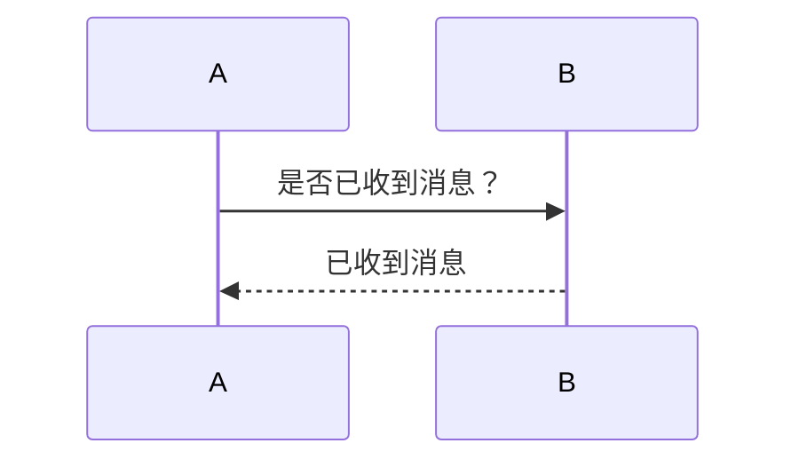
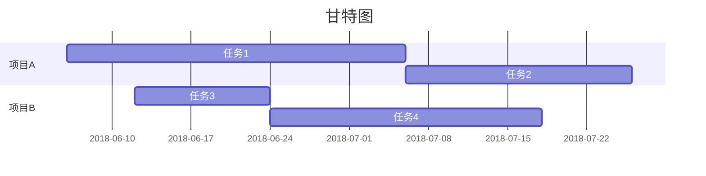

## Welcome to GitHub Pages

You can use the [editor on GitHub](https://github.com/ycbd/ycbd.github.io/edit/master/index.md) to maintain and preview the content for your website in Markdown files.

Whenever you commit to this repository, GitHub Pages will run [Jekyll](https://jekyllrb.com/) to rebuild the pages in your site, from the content in your Markdown files.

### Markdown

Markdown is a lightweight and easy-to-use syntax for styling your writing. It includes conventions for

```markdown
Syntax highlighted code block

# Header 1
## Header 2
### Header 3

- Bulleted
- List

1. Numbered
2. List

**Bold** and _Italic_ and `Code` text

[Link](url) and 
```

For more details see [GitHub Flavored Markdown](https://guides.github.com/features/mastering-markdown/).

### Jekyll Themes

Your Pages site will use the layout and styles from the Jekyll theme you have selected in your [repository settings](https://github.com/ycbd/ycbd.github.io/settings). The name of this theme is saved in the Jekyll `_config.yml` configuration file.

### Support or Contact

Having trouble with Pages? Check out our [documentation](https://help.github.com/categories/github-pages-basics/) or [contact support](https://github.com/contact) and we’ll help you sort it out.


# 将进酒
**君不见，黄河之水天上，奔流到海不复回。**
```
君不见，高堂明镜悲白发，朝如青丝暮成雪
```

* 人生得意须尽欢⑷，莫使金樽空对月
* 天生我材必有用，千金散尽还复来


| A | B | C |D  |
| --- | --- | --- | --- |
|2  | 3 |4  |5  |
|  A|  |  | 1 |
|  |  D| D |  |


* [ ] 烹羊宰牛且为乐，会须一饮三百杯;
* [ ] 岑夫子，丹丘生⑹，将进酒，杯莫停




